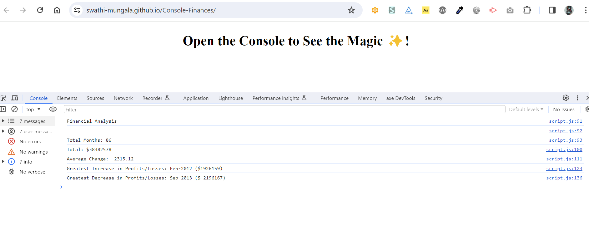

# Console-Finances
Welcome to Finances website!

## Acceptance criteria

- My task is to write JavaScript code that analyzes the records to calculate each of the following:

- The total number of months included in the dataset.

- The net total amount of Profit/Losses over the entire period.

- The average of the **changes** in Profit/Losses over the entire period.

- The greatest increase in Profit/Losses (date and difference in the amounts) over the entire period.

- The greatest decrease in Profit/Losses (date and difference in the amounts) over the entire period.

## Finances website screenshot
- Here is the screenshot of Finances website.

## Live site link
Here is the link of deployed website
[Live site link](https://swathi-mungala.github.io/Console-Finances/)

## Github repo link
Here is the link of Github repo
[Github repo](https://github.com/swathi-mungala/Console-Finances)

## Installation
Clone the repository from github to your local using HTTPS or SSH or Github CLI and then run it in local.

## Usage
N/A

## Credits

N/A

## License

[MIT](https://choosealicense.com/licenses/mit/)

## Badges

N/A

## Features

N/A

## How to Contribute

N/A

## Tests

N/A